# Touch ID Mechanical Keyboard Conversion

I had been wanting to make a Touch ID button out of an old Magic Keyboard for a while, but when I finally got my hands on a Touch ID keyboard, I decided to mod Touch ID directly into my mechanical keyboard! I have seen a few people do this in a few different ways, but have yet to find a good step by step, so I figured I would write about my experience!

This writeup aims to mod the keyboard WITHOUT adding a secondary port to the keyboard, like most do. However, it is pretty easy to do that, by stopping after step 6. This may work better for you if you are not as comfortable soldering.

This writeup also uses the original keycap and the key switch (albeit unusable), you can skip steps 2 & 3 if you would prefer to make a 3D printed fake switch, as shown below:
https://www.reddit.com/r/MechanicalKeyboards/comments/1j5wqe6/touchid_mechanical_keyboard/ 

Finally, this is intended as a non destructive mod. All this means is that the both keyboards could be restored to normal without any functional damage. The only exception to this is the keycap and switch, which are both really cheap replacements.

My Tools & Hardware:
- Donor Keyboard: Magic Keyboard with Touch ID, Lightning, Smaller layout
- Mechanical Keyboard: Keychron K1 SE (Non Hotswap, painted white)
- Dremel: Fantiks F2 Master Mini
- Drill Bits: Tiny one from the Fantiks dremel for a pilot hole, and a 4/10” drill bit for the main hole
- Lightning Male breakout, from Aliexpress (Sub for USBC if applicable to your donor board)
- 3.7 to 5V Step up board
- Resistors (3 1Ω, 1 4.7kΩ, 1 1.5kΩ)
- Kapton tape

It is worth noting that I am doing this on a slim mechanical keyboard, so some steps may vary slightly for you. This keyboard does also have a battery and bluetooth (I use it wired), which will come into play when wiring.

## Step 1: Remove Parts from Magic Keyboard
I will not recount how exactly to take apart a magic keyboard for its touch ID sensor. Thankfully there are a bunch of guides out there! I recommend this one from Khaos Tian on Github. 

https://gist.github.com/KhaosT/1406a6b6bea38f59e059c2afcb39d545

You will need the following parts from your magic keyboard:

- Logic Board
- Battery (Optional)
- Touch ID sensor
- Lightning or USBC port

It is worth noting that you must remove the plastic key cover from the sensor. This can be done by simply prying the covering off of the metal frame, but be careful (if you want to keep the old keyboard in good shape), the plastic breaks easily. This cover is not needed for our conversion, so it's not important.
## Step 2: Prepare your keycap and sensor
I would recommend having a few spare keycaps on hand, to practice with. You will want to do the following:
- On a keycap, find the exact center of the cap. Then, drill a small pilot hole, perfectly centered (This is not needed, but makes it way easier to center)
- Dremel down the edges of the Touch ID frame, if needed. This may help it fit better.
- Using a 4/10” Drill bit, drill using the pilot hole. You will now have a keycap with a large hole in it that the Touch ID sensor should fit into.
- This part varies widely depending on your keycaps. You need to dremel out the interior of the keycap, until the touch ID sensor fits in flush. Below is the bit I used.
- Finally, using a polishing bit on your dremel, smooth out any rough edges.

Now, you should have a pretty smooth keycap, with touch ID!

*Dremel Bit used for keycap carving*

*Touch ID sensor after dremeling*
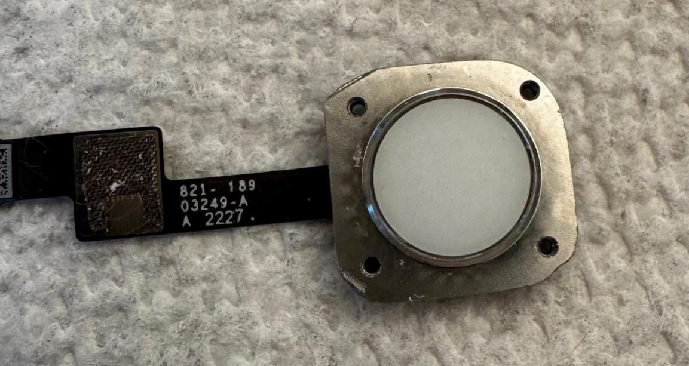

*Keycap After drilling*

*Test Keycap without carving (to show thicker plastic)*
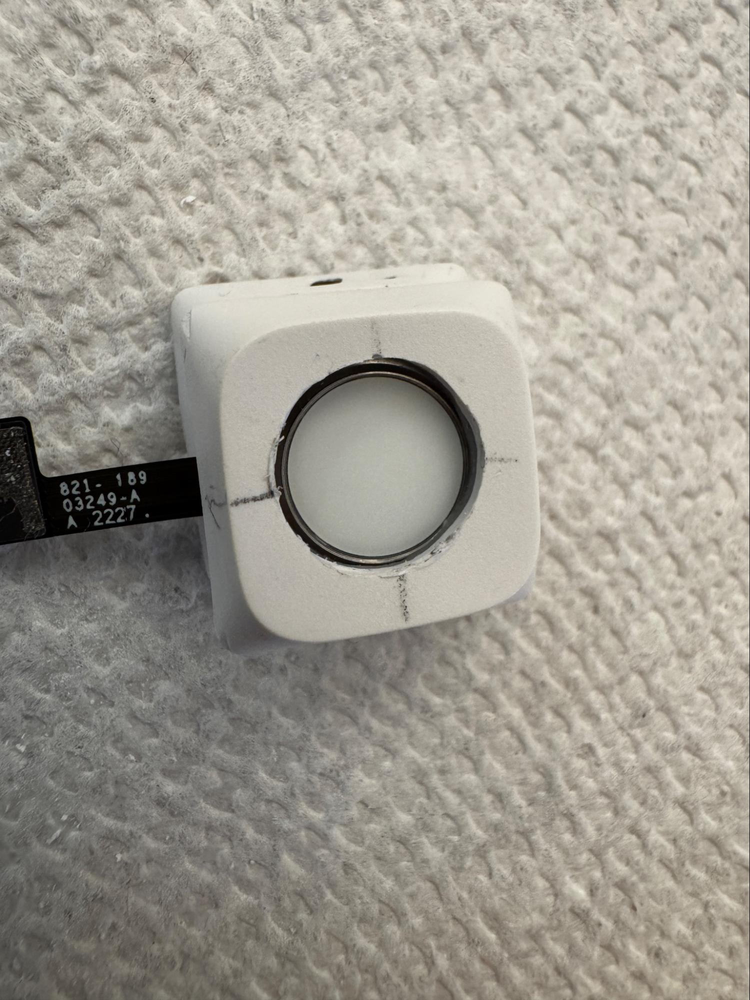

*Final Keycap, after carving*
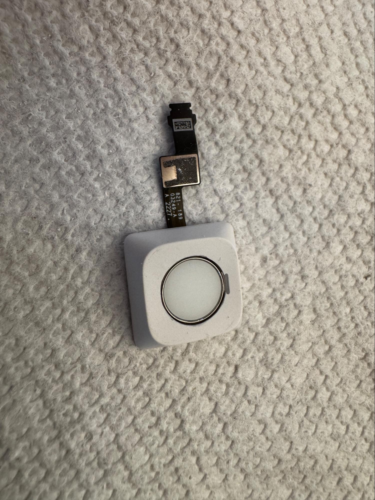
## Step 3: Prepping your Keyswitch for cable routing

This specific mod removes the actuation of the switch in question, for fear of wearing on the fragile ribbon cable. It does retain the power button included on the Touch ID switch, however.

- Take apart your keyswitch, and remove the internal spring. *Keep the pins, the shell, and the colored stem. These will be used*
- Dremel out the side of the top case your ribbon cable will go through (Left side for me). *My switches have supports to the left, I drilled out that part of the stem as well*
- Dremel off the spring well on the lower casing (might need to dremel out a bigger slot for the ribbon cable to fit through)
- Dremel off the base of the stem, the part that the spring goes around.
- Superglue the stem to the upper case. I am also using hot glue for reinforcement.
- Disconnect the two pins in the lower case, but do not remove them. We still need them for support, but they will not be used for electronics at all. I used wirecutters to chop off part of one of the pieces so they never accidentally touch.

Now, you have a semi hollow switch. If done correctly, you should be able to thread the Touch ID ribbon cable directly through it. Now, we need to connect the keycap to the switch, before attaching the whole assembly to your keyboard.

*Parts Needed from switch*
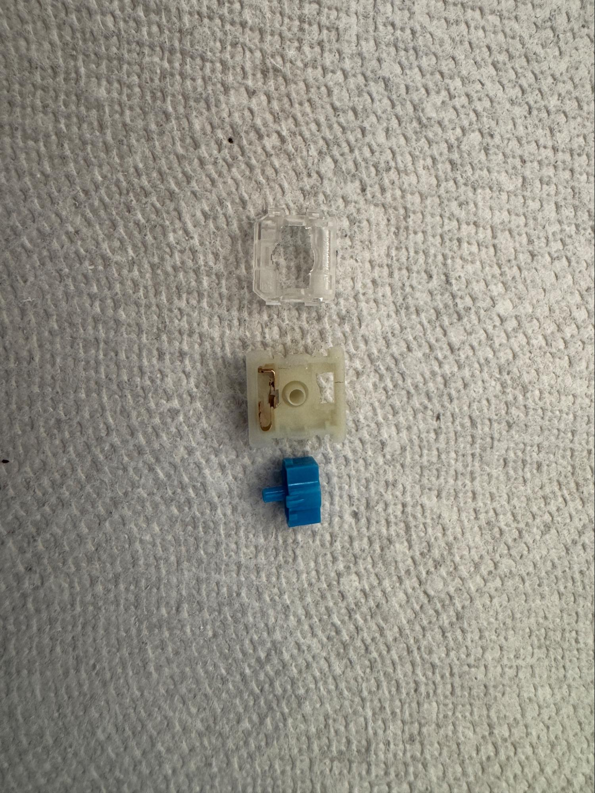

*Parts After carving & glueing*
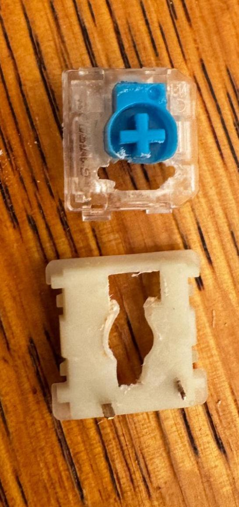
## Step 4: Prepping the key assembly

First off, print the below file. You may need to adjust the stem length.
https://www.printables.com/model/1561591-touch-id-sensor-keycap-plate-stem

*(remix of Calvins plate, made to fit in a keycap https://www.printables.com/model/355924-clickable-touch-id-box-tkl-board-wired/files)*

Then, put the C-Plate on the button end of the touch ID assembly, you may need to dremel out the holes depending on printer tolerances.

Finally, file down the keycap stem to match the height of a normal keycap when assembled. Then, use minor amounts of hot glue to fasten the Touch ID sensor to the keycap. Ensure that hot glue is only used on the solid sides of the plate, doing all 4 sides will remove the button click.
Now, you are done assembling your keycap Touch ID assembly.

Now, thread the ribbon cable through the switch assembly, and attach the keycap to the keyswitch.

You are now done with the hard part! Now, all we need to do is wire this up in the keyboard.

*Touch ID with Bracket (My printer did NOT like printing the bracket with supports)*
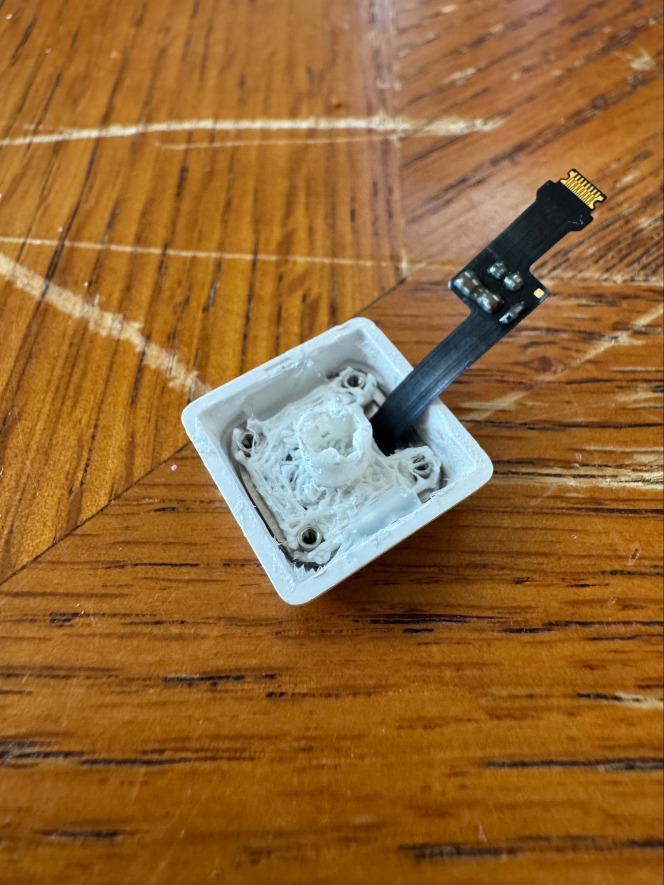

*Assembled Key Switch*
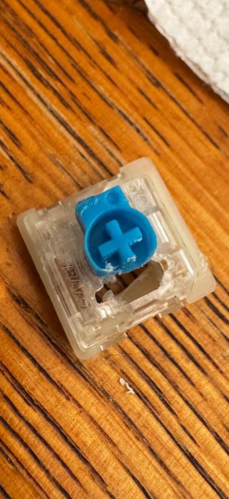
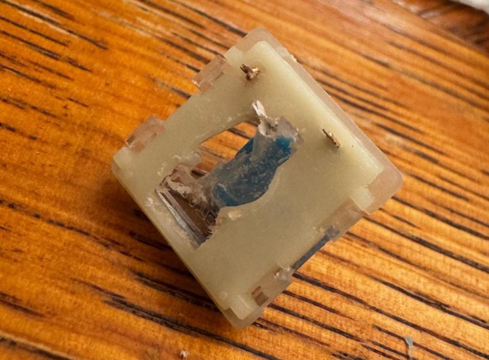

*Fully Assembled Key Assembly (Interior of keycap looks different, was a different revision of the project)*

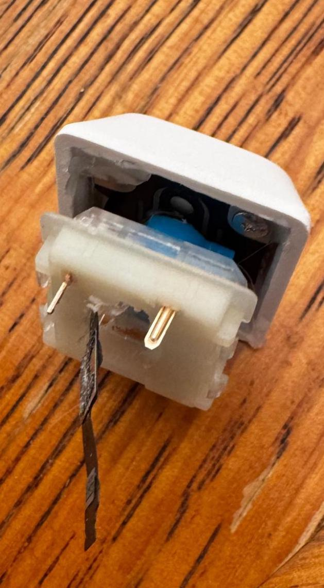
## Step 5: Preparing the keyboard

- First off, remove the keyswitch you want to replace with Touch ID. *My key changes lighting, so I want to keep that intact. As such, I will be wiring that switch to the neighboring switch to retain functionality, but this is optional.*
- Then, solder the key assembly into the same spot, threading the ribbon cable through the hole in the keyboard PCB.
- Once the key assembly is installed, carefully hook everything up, and test that it still works.

*Key switches removed*
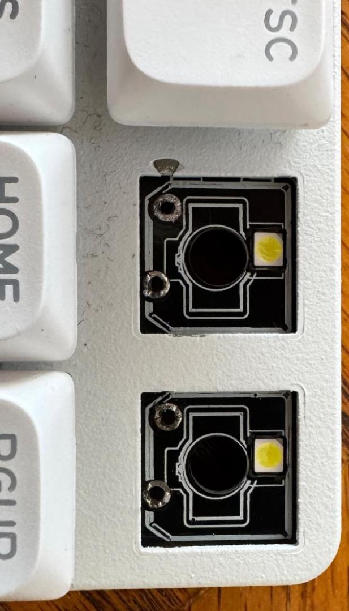

*Touch ID ribbon cable fitted through, yellow bodge wire for my light key*
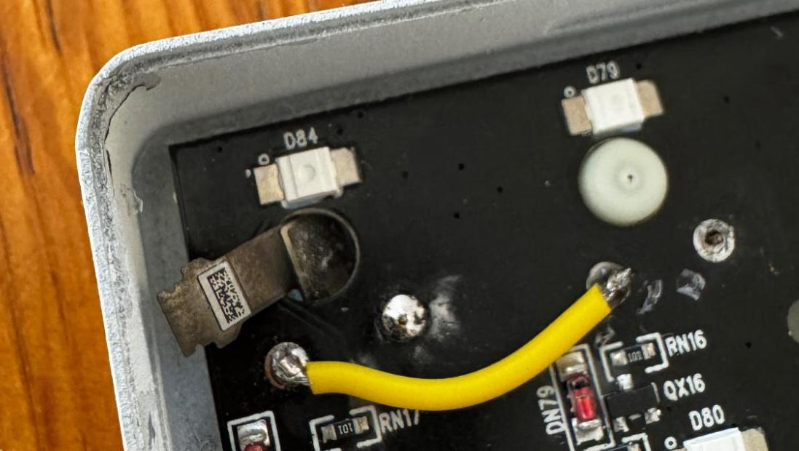
## Step 6: Fitting components into the keyboard

Now, put everything together! Ensure that the motherboard (and optionally, battery) will fit into the keyboard, and ensure that you insulate everything, so as to not cause shorts. You may need to cut off some keyboard supports if they get in the way.

At this point, you should be mostly done if you do not mind having a second charge port! If that is the case, just drill a hole somewhere, and mount the lightning connector from the magic keyboard to it. I, however, want a more seamless experience, with only one charge port.

*Keyboard with kapton tape, and magic keyboard components inside (minus battery)*
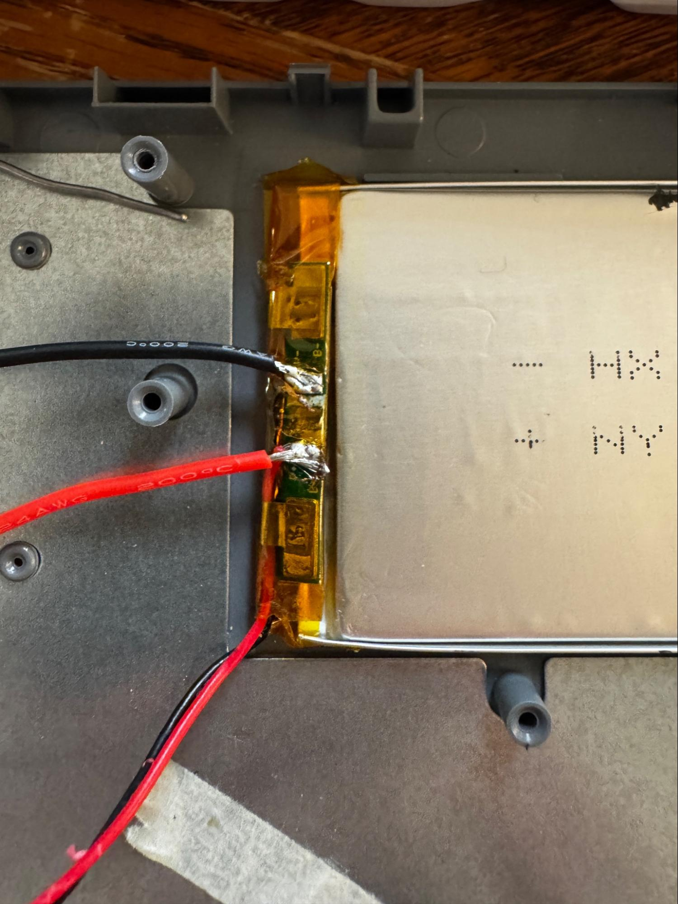
## Step 7: Merging chargers

This step has two options. Either solder the power to the keyboard battery (if applicable), or solder the power directly from the USB port power lines. All we are doing is stealing power from the main keyboard to power the Touch ID sensor.

This ended up being more complicated than expected, and required some extra components. This is because Lightning needs 5V to charge, and needs certain voltages on the data pins to activate. I cannot speak to those with a USB-C Magic Keyboard, as I do not have one to test with.

First off, peel the yellow tape off of your battery, and locate the + and - pads. Then, solder wires onto these pads. Ensure that you cover the battery with fresh kapton tape. (You can also wire from the batteries + and - wires used for the keyboard connector)

Then, wire these into your step up converter, ensuring that it is set to output 5V (read the manual for your adapter)

Now, the tricky part. Getting the correct voltages to your data pins. This can be done with a series of resistors, you just need to end up with 2.7/2.8V on D-, and 2V on D+. Below, I will get into my setup for this.

Then, simply wire everything to your lightning header, and plug it into the magic keyboard port! At this point, it should work great, regardless of if you removed or kept the magic keyboard battery.

*Battery, with new wires soldered onto the pads.*

## Step 8: Resistor Layout

Huge thanks to Lila Prebynski for her help on the resistor layout! We ended up using 3 1kΩ resistors, a 4.7kΩ resistor, and a 1.5kΩ resistor. It is worth noting that the 1.5kΩ is less common in variety packs of resistors!

I will link diagrams and photos below, but here is how it works:
The 1.5kΩ Resistor brings down the 5V power to roughly 2V, while both the 1kΩ and 4.7kΩ resistors work in parallel to bring 5V power down to roughly 2.8V. The two remaining 1kΩ resistors bring everything down for ground.

Below, I will link the bracket I made for this, but a piece of cardstock with holes poked in it would work just as well! Just ensure that everything is wired up correctly, and you should not have any issues.

https://www.printables.com/model/1561638-lightning-5v-charging-setup

*Electrical Diagram (Resistor Values are 1/10 actual)*

*Drawn Diagram*
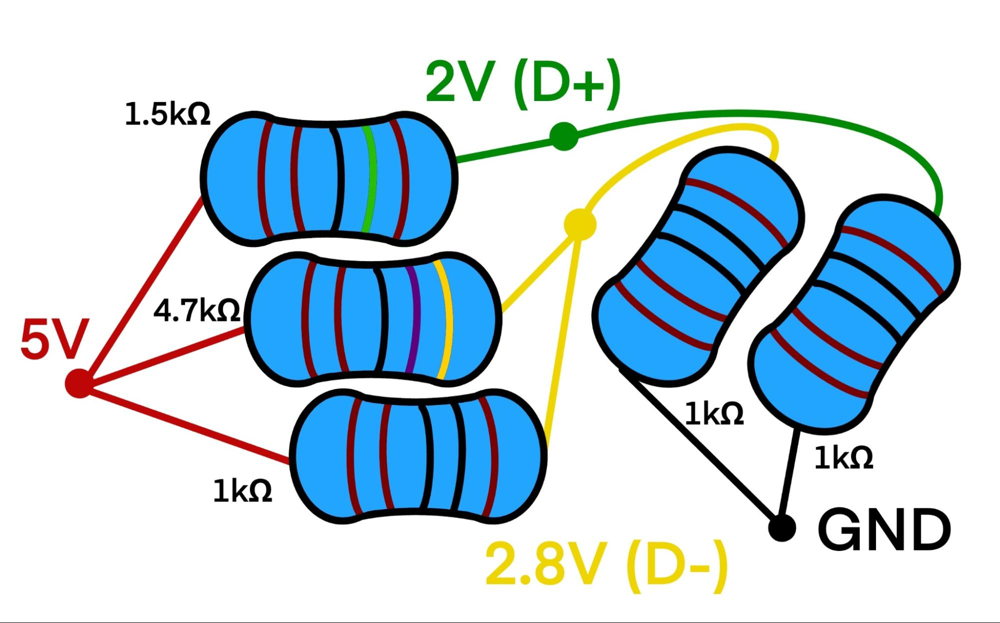

*Finished Print*
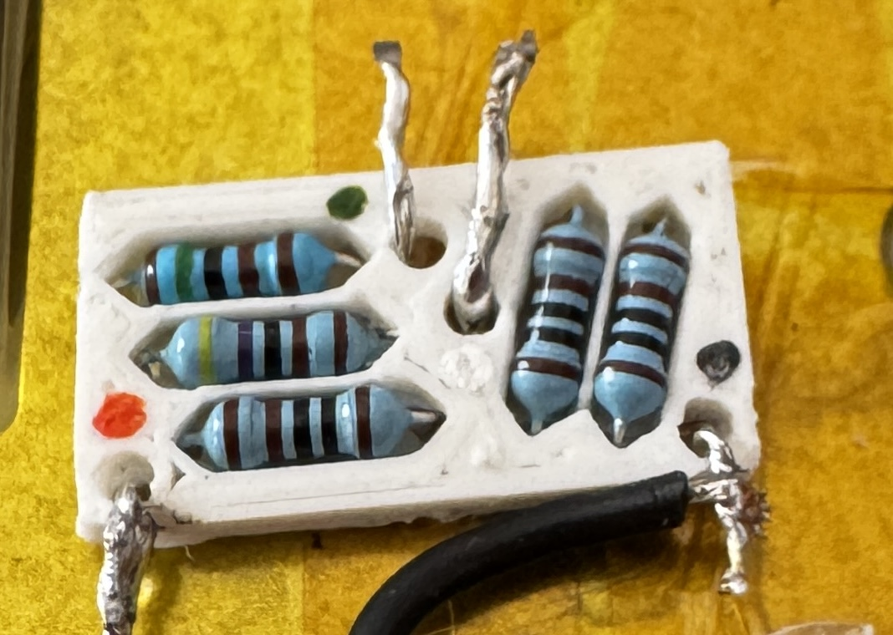

*Cardboard vs Printed bracket*
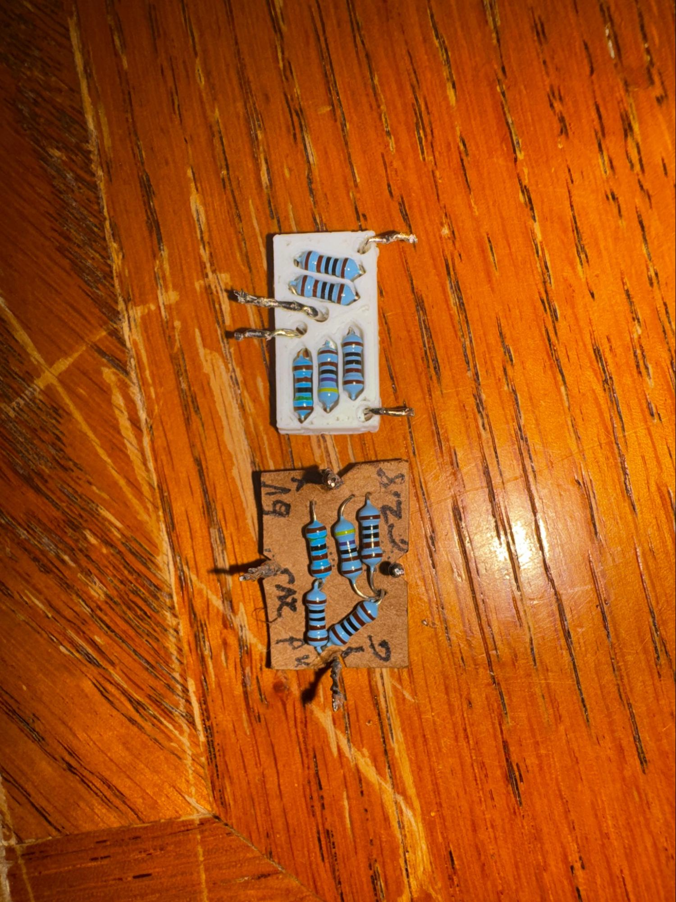
## Complete!

Now, you should be all set! Make sure to test everything BEFORE closing up your keyboard fully, to ensure that it all works. If you have any notes, achieve this project by doing stuff different, or have questions, ask me! I will keep an eye out, and add it to an FAQ section.
## Acknowledgements

 - [Khaos Tian Magic Keyboard Teardown](https://gist.github.com/KhaosT/1406a6b6bea38f59e059c2afcb39d545)
 - [Calvins C-Plate Design, remixed for this project](https://www.printables.com/model/355924-clickable-touch-id-box-tkl-board-wired/files)
 - [Lila Prebynski, For her fantastic circuits knowledge!]()

